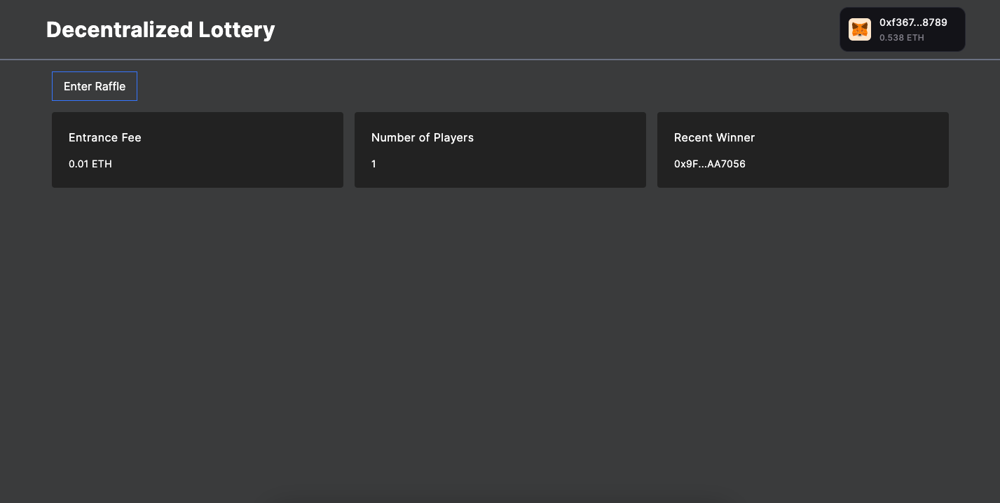

# Decentralized Raffle

## About

The Raffle project leverages the Foundry smart contract development framework, specifically designed for Ethereum Blockchain applications. Ensuring transparency and fairness, the raffle incorporates Chainlink's Verifiable Random Function (VRF) to obtain genuinely random numbers. Automation is seamlessly integrated using Chainlink's automation capabilities, allowing for the automatic execution of the raffle draw.

---

## Smart Contract

[Raffle Smart Contract](https://sepolia.etherscan.io/address/0xa4ef0128e0bd906c1d3d3af704861af1641d4e74#code)  
[Github](https://github.com/allwin199/raffle-foundry)

---

## Workflow

## Thank You :)
